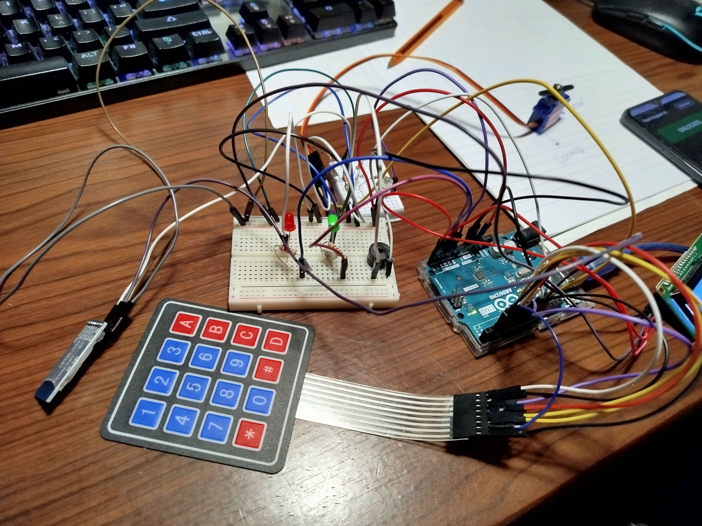
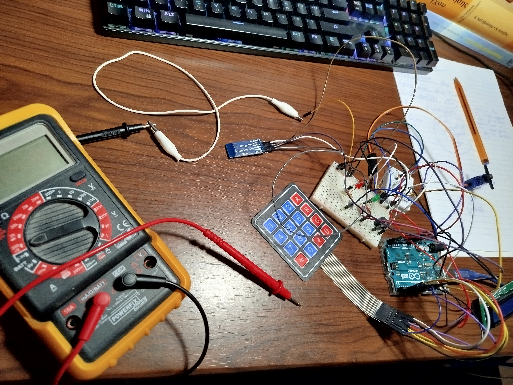

# Vault Keypad v3 (Secure + Bluetooth + Android App)

**🇬🇧 [English](#english) · 🇬🇷 [Ελληνικά](#ελληνικά)**



> 📸 **Proof of Concept / Απόδειξη λειτουργίας:** στις φωτό ([`photos/`](photos)) η ίδια κλειδαριά με το μπλε **HC-05** module προστιθέμενο (αριστερά) — keypad + Bluetooth μαζί. Δες και τη φωτό με το **πολύμετρο** πιο κάτω, από το debugging του voltage divider. The same lock with the blue **HC-05** module wired in — keypad + Bluetooth together. See also the **multimeter** photo further down, from the voltage-divider debugging.

📄 **Arduino code:** [`vault_keypad_v3_bluetooth.ino`](vault_keypad_v3_bluetooth.ino)
📱 **Android app:** [`android/MainActivity.kt`](android/MainActivity.kt) · [`android/activity_main.xml`](android/activity_main.xml)

---

## English

The secure [Vault Keypad v2](../vault_keypad_v2/) lock, now controllable from a **native Android app** over **HC-05 Bluetooth** — *without weakening the security*. This is the deliberate counter-point to the v1 → v2 story: adding a wireless feature is where most projects accidentally re-introduce the bugs v2 fixed, so v3 shows how to add it **right**.

```
[4x4 Keypad] ┐
             ├─> [Arduino Uno] <─> [HC-05 BT] <─> [Android App]
[Servo lock] ┘   v2 security        RFCOMM        Kotlin/XML
```

> 🎓 Educational portfolio project. Security demo / authorized testing only.

### The point: v1 → v2 → v3

| | [v1](../vault_keypad_v1/) | [v2](../vault_keypad_v2/) | **v3 (this)** |
|---|---|---|---|
| PIN storage | plaintext RAM | hashed in EEPROM | hashed in EEPROM |
| Wrong tries | no lockout | 3 → 30 s lockout | 3 → 30 s lockout (**keypad + BT**) |
| Control | keypad | keypad | keypad **+ phone app** |
| PIN over the air | — | — | **never sent** (challenge-response) |
| Remote brute-force | — | — | **infeasible** (3 tries / 30 s) |

The naive build (v1) was crackable; v2 fixed the fundamentals; v3 proves you can bolt on Bluetooth **and keep** those guarantees instead of throwing them away the moment a feature ships.

### How the PIN stays secret over Bluetooth

The PIN never travels over the air. The phone proves it knows the PIN with a **challenge-response**, using the same FNV-1a hash on both sides:

```
app  → UNLOCK
lock → $V,CHALLENGE:<nonce>#                       (fresh random number each time)
app  → RESP:<fnv16( fnv16(PIN) + ":" + nonce )>
lock → $V,UNLOCKED#   /   $V,DENIED:n#   /   $V,LOCKOUT:s#
```

- **No plaintext PIN** on the wire — only a hash derived from a one-time `nonce`.
- **Replay-proof:** the nonce is single-use and burned after one answer, so a sniffed response can't be replayed.
- **Same lockout:** a wrong BT response counts toward the 3-try lockout, so a remote attacker is throttled to 3 attempts / 30 s — brute-forcing 10,000 PINs would take days, not milliseconds.
- **Duress code** still works (over BT too): it unlocks normally but fires a silent `$V,ALERT:DURESS#` to the app.

### Bluetooth protocol

**App → Lock** (newline-terminated):

| Command | Action |
|---|---|
| `UNLOCK` | request a challenge |
| `RESP:<hash>` | answer the challenge |
| `LOCK` | lock |
| `SETHASH:<hash>` | change PIN — sends only `fnv16(newPIN)`, accepted **only while unlocked** |
| `STATUS` | report current state |

**Lock → App** (framed `$V,...#`): `LOCKED` · `UNLOCKED` · `CHALLENGE:<nonce>` · `DENIED:<fails>` · `LOCKOUT:<sec>` · `PIN_SET` · `NEED_UNLOCK` · `ALERT:DURESS` · `READY`.

### Materials

| Part | Qty |
|---|---|
| Arduino Uno | 1 |
| HC-05 / HC-06 Bluetooth | 1 |
| LCD 16x2 I2C | 1 |
| Keypad 4×4 | 1 |
| Servo SG90 | 1 |
| Green / Red LED | 1 each |
| Passive buzzer | 1 |
| Resistor 220Ω (LEDs) | 2 |
| Resistor 1kΩ + 2kΩ (BT divider) | 1 each |
| Breadboard + jumpers | ~30 |
| Android phone (API 23+) | 1 |

**Libraries:** `LiquidCrystal_I2C`, `Keypad`, `Servo`, `EEPROM`, `SoftwareSerial` (built-in)

### Wiring

Same as v1/v2, plus the HC-05:

```
Keypad 4×4   ROW1-4 -> 2,3,4,5    COL1-4 -> 6,7,8,9
Servo SG90   SIGNAL -> pin 11
Buzzer       + -> pin 12
Green LED    anode -> A2 -> 220Ω -> GND
Red LED      anode -> A3 -> 220Ω -> GND
LCD I2C      SDA -> A4   SCL -> A5
HC-05        TXD -> pin 10               (SoftwareSerial RX, direct)
             RXD -> divider -> pin A1    (pin A1 -> 1kΩ -> RXD, and RXD -> 2kΩ -> GND)
             VCC -> 5V   GND -> GND
```

> The HC-05 RX is 3.3V logic — keep the 1kΩ/2kΩ divider so the 5V TX from pin A1 doesn't damage it.

#### HC-05 wiring, step by step

You only add the HC-05 — the rest of the v1/v2 circuit stays exactly the same. The HC-05 has 6 pins but we use **4**: `VCC`, `GND`, `TXD`, `RXD` (leave `EN`/`STATE` unconnected).

**The 3 easy wires (direct):**

```
HC-05 VCC  ->  Arduino 5V
HC-05 GND  ->  Arduino GND
HC-05 TXD  ->  Arduino pin 10     (direct, no resistor)
```

**The tricky wire — RXD through a voltage divider:** Arduino pin A1 outputs **5V**, but the HC-05 RXD only tolerates **3.3V**. Two resistors drop it. Pick an empty breadboard row as a "node" where three things meet:

```
 Arduino pin A1 ──[ 1kΩ ]──┬───────────────→ HC-05 RXD
                           │
                        [ 2kΩ ]
                           │
                          GND
```

1. `1kΩ` from **pin A1** to the node
2. a wire from the node to **HC-05 RXD**
3. `2kΩ` from the node to **GND**

> No 2kΩ? Put **two 1kΩ in series** = 2kΩ.

**Two common mistakes:**

- ⚠️ **TXD/RXD are crossed:** HC-05 **TXD → Arduino pin 10**, Arduino **pin A1 → HC-05 RXD**. If it won't connect, check these first.
- ✅ **Uploading is fine with the HC-05 connected:** because BT is on pins 10/A1 (SoftwareSerial), it does **not** clash with the USB upload (only pins 0/1 would). No need to unplug anything.
- ⚠️ **Do not use pin 13 for BT TX:** the on-board LED on pin 13 loads the line and breaks SoftwareSerial transmit — that's why TX is on A1.

### Android app setup

1. **Android Studio → New Project → Empty Views Activity**, language **Kotlin**, package `com.vault.keypad`, min SDK **23**.
2. Enable ViewBinding in `app/build.gradle`:
   ```gradle
   android { buildFeatures { viewBinding true } }
   dependencies { implementation 'androidx.cardview:cardview:1.0.0' }
   ```
3. Add Bluetooth permissions to `AndroidManifest.xml`:
   ```xml
   <uses-permission android:name="android.permission.BLUETOOTH" android:maxSdkVersion="30" />
   <uses-permission android:name="android.permission.BLUETOOTH_ADMIN" android:maxSdkVersion="30" />
   <uses-permission android:name="android.permission.BLUETOOTH_CONNECT" />
   ```
4. Replace `MainActivity.kt` and `res/layout/activity_main.xml` with the files in [`android/`](android/).
5. **Pair** the HC-05 from Android Settings (PIN `1234`/`0000`), run the app, tap **Connect**, pick the device.

### Connecting the app to the lock (step by step)

Do this **once** the circuit is built and powered. Bluetooth pairing happens in Android Settings; the app only *connects* to an already-paired module.

1. **Power the Arduino** (USB or external). The HC-05 LED blinks fast — that means "not connected yet".
2. **Pair once in Android Settings:** Settings → Bluetooth → turn it on → tap the device named **HC-05** (or **HC-06 / linvor / JDY-31**) → enter PIN **`1234`** (some modules use `0000`). It moves to "Paired devices". You only do this the first time.
3. **Open the Vault Keypad app** and tap **Connect** (top-right). Grant the "Nearby devices / Bluetooth" permission if asked.
4. **Pick the HC-05** from the list that pops up. The status changes to `● HC-05` and the HC-05 LED goes to a slow/steady blink — now you're connected.
5. **Unlock:** type the 4-digit PIN on the app's number pad → tap **OPEN**. The servo turns and the card shows `UNLOCKED`. (Default PIN is `1234` until you change it.)
6. **Other actions:** **Lock** locks it again · type a new PIN while unlocked + **Set PIN** changes it.

> Connection issues? See the troubleshooting table below.

### Troubleshooting

| Problem | Cause | Fix |
|---|---|---|
| HC-05 not in the list | not paired yet | Pair it in Android Settings first (step 2) |
| "Connection failed" | wrong device / busy | Make sure no other phone is connected; retry Connect |
| Connects then drops | weak 5V / power | Power the Arduino from USB or a solid 5V source |
| Tap OPEN, nothing | TXD/RXD swapped | HC-05 TXD→pin10, pin A1→HC-05 RXD (via divider) |
| Phone never updates **and** OPEN does nothing | Arduino→phone (TX) line dead — usually a bad divider | Measure RXD→GND: must be ~**2.5–3.3V**. Wrong resistor value? (see note) |
| "Locked out — wait 30s" | 3 wrong PINs | Wait 30 s; the same lockout guards keypad **and** app |
| App opens but no "Connect" effect | BT permission denied | Android Settings → Apps → Vault Keypad → Permissions → allow Nearby devices |

> 💡 **Real-build gotcha (what actually went wrong here):** the phone wasn't updating at all — unlocking on the keypad didn't turn the app card green, and the app's OPEN did nothing. Both point to the **Arduino → phone (TX) line being dead**. The cause was a **wrong resistor in the divider: a 10kΩ used by mistake instead of the 1kΩ** (they look alike!). That left the HC-05 RXD at only **0.44V** — far below the ~2.3V it needs to read a logic "1", so the lock's replies never reached the module. **Fix:** correct the divider so RXD measures roughly **2.5–3.3V** (≈2.7V works perfectly). Always check RXD→GND with a multimeter after wiring.


> _Tracking down the dead TX line — measuring the HC-05 RXD voltage with the multimeter._

### Try it yourself

1. Upload the sketch (default PIN `1234`, stored as a hash in EEPROM).
2. Connect from the app, type the PIN, tap **OPEN** → the servo unlocks (the PIN never left the phone).
3. Type a wrong PIN three times → the lock and the app both show the 30 s lockout — the same defence whether the attacker is at the keypad or on Bluetooth.
4. While unlocked, type a new PIN and tap **Set PIN** → only the hash is sent and saved to EEPROM.

---

## Ελληνικά

Η ασφαλής κλειδαριά [Vault Keypad v2](../vault_keypad_v2/), τώρα με έλεγχο από **native Android app** μέσω **HC-05 Bluetooth** — *χωρίς να μειώνεται η ασφάλεια*. Είναι το σκόπιμο αντίβαρο στην ιστορία v1 → v2: το ασύρματο feature είναι το σημείο όπου τα περισσότερα project ξανα-εισάγουν κατά λάθος τα bugs που διόρθωσε το v2, οπότε το v3 δείχνει πώς να το προσθέσεις **σωστά**.

```
[Keypad 4x4] ┐
             ├─> [Arduino Uno] <─> [HC-05 BT] <─> [Android App]
[Servo lock] ┘   v2 security        RFCOMM        Kotlin/XML
```

> 🎓 Εκπαιδευτικό portfolio project. Μόνο για security demo / authorized testing.

### Το νόημα: v1 → v2 → v3

| | [v1](../vault_keypad_v1/) | [v2](../vault_keypad_v2/) | **v3 (εδώ)** |
|---|---|---|---|
| Αποθήκευση PIN | plaintext RAM | hashed σε EEPROM | hashed σε EEPROM |
| Λάθη | χωρίς lockout | 3 → lockout 30 δευτ. | 3 → lockout 30 δευτ. (**keypad + BT**) |
| Έλεγχος | keypad | keypad | keypad **+ app κινητού** |
| PIN στον αέρα | — | — | **δεν στέλνεται ποτέ** (challenge-response) |
| Remote brute-force | — | — | **ανέφικτο** (3 tries / 30 δευτ.) |

Το αφελές build (v1) έσπαγε· το v2 διόρθωσε τα βασικά· το v3 αποδεικνύει ότι μπορείς να προσθέσεις Bluetooth **κρατώντας** αυτές τις εγγυήσεις, αντί να τις πετάξεις μόλις βγει το feature.

### Πώς μένει κρυφό το PIN πάνω από Bluetooth

Το PIN δεν ταξιδεύει ποτέ στον αέρα. Το κινητό αποδεικνύει ότι ξέρει το PIN με **challenge-response**, χρησιμοποιώντας τον ίδιο FNV-1a hash και στις δύο πλευρές:

```
app  → UNLOCK
lock → $V,CHALLENGE:<nonce>#                       (νέος τυχαίος αριθμός κάθε φορά)
app  → RESP:<fnv16( fnv16(PIN) + ":" + nonce )>
lock → $V,UNLOCKED#   /   $V,DENIED:n#   /   $V,LOCKOUT:s#
```

- **Κανένα plaintext PIN** στη γραμμή — μόνο ένας hash παραγόμενος από ένα μιας χρήσης `nonce`.
- **Αντι-replay:** το nonce είναι μιας χρήσης και «καίγεται» μετά την απάντηση, οπότε μια υποκλαπείσα απάντηση δεν ξαναπαίζει.
- **Ίδιο lockout:** λάθος απάντηση BT μετράει στο lockout των 3 προσπαθειών, άρα ένας remote επιτιθέμενος περιορίζεται σε 3 tries / 30 δευτ. — το να σπάσεις 10.000 PIN θα έπαιρνε μέρες, όχι χιλιοστά.
- **Duress code** δουλεύει ακόμα (και μέσω BT): ξεκλειδώνει κανονικά αλλά στέλνει σιωπηλό `$V,ALERT:DURESS#` στην app.

### Πρωτόκολλο Bluetooth

**App → Lock** (με newline):

| Εντολή | Ενέργεια |
|---|---|
| `UNLOCK` | ζήτησε challenge |
| `RESP:<hash>` | απάντησε στο challenge |
| `LOCK` | κλείδωμα |
| `SETHASH:<hash>` | αλλαγή PIN — στέλνει μόνο `fnv16(newPIN)`, δεκτό **μόνο όταν είναι ξεκλείδωτο** |
| `STATUS` | κατάσταση |

**Lock → App** (framed `$V,...#`): `LOCKED` · `UNLOCKED` · `CHALLENGE:<nonce>` · `DENIED:<fails>` · `LOCKOUT:<sec>` · `PIN_SET` · `NEED_UNLOCK` · `ALERT:DURESS` · `READY`.

### Υλικά

| Υλικό | Ποσότητα |
|---|---|
| Arduino Uno | 1 |
| HC-05 / HC-06 Bluetooth | 1 |
| LCD 16x2 I2C | 1 |
| Keypad 4×4 | 1 |
| Servo SG90 | 1 |
| LED πράσινο / κόκκινο | 1 το καθένα |
| Passive buzzer | 1 |
| Αντίσταση 220Ω (LEDs) | 2 |
| Αντίσταση 1kΩ + 2kΩ (BT divider) | 1 η καθεμία |
| Breadboard + jumpers | ~30 |
| Android κινητό (API 23+) | 1 |

**Libraries:** `LiquidCrystal_I2C`, `Keypad`, `Servo`, `EEPROM`, `SoftwareSerial` (built-in)

### Συνδεσμολογία

Ίδια με v1/v2, συν το HC-05:

```
Keypad 4×4   ROW1-4 -> 2,3,4,5    COL1-4 -> 6,7,8,9
Servo SG90   SIGNAL -> pin 11
Buzzer       + -> pin 12
LED πράσινο  anode -> A2 -> 220Ω -> GND
LED κόκκινο  anode -> A3 -> 220Ω -> GND
LCD I2C      SDA -> A4   SCL -> A5
HC-05        TXD -> pin 10               (SoftwareSerial RX, απευθείας)
             RXD -> divider -> pin A1    (pin A1 -> 1kΩ -> RXD, και RXD -> 2kΩ -> GND)
             VCC -> 5V   GND -> GND
```

> Το RX του HC-05 είναι λογική 3.3V — κράτα τον διαιρέτη 1kΩ/2kΩ ώστε τα 5V του pin A1 να μην το καταστρέψουν.

#### Σύνδεση HC-05, βήμα-βήμα

Προσθέτεις **μόνο** το HC-05 — το υπόλοιπο κύκλωμα του v1/v2 μένει ίδιο. Το HC-05 έχει 6 ακίδες αλλά χρησιμοποιούμε **4**: `VCC`, `GND`, `TXD`, `RXD` (τα `EN`/`STATE` μένουν ασύνδετα).

**Τα 3 εύκολα καλώδια (απευθείας):**

```
HC-05 VCC  ->  Arduino 5V
HC-05 GND  ->  Arduino GND
HC-05 TXD  ->  Arduino pin 10     (απευθείας, χωρίς αντίσταση)
```

**Το δύσκολο καλώδιο — RXD μέσω διαιρέτη τάσης:** το pin A1 βγάζει **5V**, αλλά το RXD του HC-05 αντέχει μόνο **3.3V**. Δύο αντιστάσεις τα ρίχνουν. Διάλεξε μια άδεια σειρά στο breadboard ως «κόμβο» όπου συναντιούνται τρία πράγματα:

```
 Arduino pin A1 ──[ 1kΩ ]──┬───────────────→ HC-05 RXD
                           │
                        [ 2kΩ ]
                           │
                          GND
```

1. `1kΩ` από το **pin A1** στον κόμβο
2. καλώδιο από τον κόμβο στο **HC-05 RXD**
3. `2kΩ` από τον κόμβο στο **GND**

> Δεν έχεις 2kΩ; Βάλε **δύο 1kΩ στη σειρά** = 2kΩ.

**Δύο συχνά λάθη:**

- ⚠️ **TXD/RXD είναι σταυρωτά:** HC-05 **TXD → Arduino pin 10**, Arduino **pin A1 → HC-05 RXD**. Αν δεν συνδέεται, έλεγξε πρώτα αυτά.
- ✅ **Το upload γίνεται κανονικά με το HC-05 συνδεδεμένο:** επειδή το BT είναι στα pins 10/A1 (SoftwareSerial), δεν συγκρούεται με το USB upload (μόνο τα pins 0/1 θα συγκρούονταν). Δεν χρειάζεται να βγάλεις τίποτα.
- ⚠️ **Μη χρησιμοποιείς pin 13 για BT TX:** το ενσωματωμένο LED στο pin 13 φορτώνει τη γραμμή και χαλάει το SoftwareSerial transmit — γι' αυτό το TX είναι στο A1.

### Setup της Android app

1. **Android Studio → New Project → Empty Views Activity**, γλώσσα **Kotlin**, package `com.vault.keypad`, min SDK **23**.
2. Ενεργοποίησε ViewBinding στο `app/build.gradle`:
   ```gradle
   android { buildFeatures { viewBinding true } }
   dependencies { implementation 'androidx.cardview:cardview:1.0.0' }
   ```
3. Πρόσθεσε permissions Bluetooth στο `AndroidManifest.xml`:
   ```xml
   <uses-permission android:name="android.permission.BLUETOOTH" android:maxSdkVersion="30" />
   <uses-permission android:name="android.permission.BLUETOOTH_ADMIN" android:maxSdkVersion="30" />
   <uses-permission android:name="android.permission.BLUETOOTH_CONNECT" />
   ```
4. Αντικατέστησε τα `MainActivity.kt` και `res/layout/activity_main.xml` με τα αρχεία στο [`android/`](android/).
5. **Pair** το HC-05 από Android Settings (PIN `1234`/`0000`), τρέξε την app, πάτα **Connect**, διάλεξε το device.

### Σύνδεση της app με την κλειδαριά (βήμα-βήμα)

Κάν' το **αφού** έχεις στήσει και τροφοδοτήσει το κύκλωμα. Το pairing γίνεται στις Ρυθμίσεις του Android· η app απλώς *συνδέεται* σε ένα ήδη paired module.

1. **Τροφοδότησε το Arduino** (USB ή εξωτερικά). Το LED του HC-05 αναβοσβήνει γρήγορα — σημαίνει «δεν έχω συνδεθεί ακόμα».
2. **Pair μία φορά στις Ρυθμίσεις:** Ρυθμίσεις → Bluetooth → άναψέ το → πάτα τη συσκευή **HC-05** (ή **HC-06 / linvor / JDY-31**) → δώσε PIN **`1234`** (κάποια module θέλουν `0000`). Πάει στα «Συνδεδεμένα». Αυτό γίνεται μόνο την πρώτη φορά.
3. **Άνοιξε την app Vault Keypad** και πάτα **Connect** (πάνω δεξιά). Δώσε την άδεια «Κοντινές συσκευές / Bluetooth» αν σου ζητηθεί.
4. **Διάλεξε το HC-05** από τη λίστα που εμφανίζεται. Η κατάσταση γίνεται `● HC-05` και το LED του HC-05 πάει σε αργό/σταθερό αναβόσβημα — τώρα είσαι συνδεδεμένος.
5. **Ξεκλείδωμα:** πληκτρολόγησε το 4ψήφιο PIN στο αριθμητικό πληκτρολόγιο της app → πάτα **OPEN**. Το servo γυρίζει και η κάρτα δείχνει `UNLOCKED`. (Το default PIN είναι `1234` μέχρι να το αλλάξεις.)
6. **Άλλες ενέργειες:** **Lock** ξανακλειδώνει · πληκτρολόγησε νέο PIN όσο είναι ξεκλείδωτο + **Set PIN** το αλλάζει.

> Προβλήματα σύνδεσης; Δες τον πίνακα παρακάτω.

### Troubleshooting

| Πρόβλημα | Αιτία | Λύση |
|---|---|---|
| Το HC-05 δεν είναι στη λίστα | δεν έγινε pair | Κάνε pair πρώτα στις Ρυθμίσεις (βήμα 2) |
| "Connection failed" | λάθος συσκευή / κατειλημμένο | Σιγουρέψου ότι δεν είναι συνδεδεμένο άλλο κινητό· ξαναπάτα Connect |
| Συνδέεται και πέφτει | αδύναμα 5V / τροφοδοσία | Τροφοδότησε το Arduino από USB ή σταθερά 5V |
| Πατάς OPEN, τίποτα | μπερδεμένα TXD/RXD | HC-05 TXD→pin10, pin A1→HC-05 RXD (μέσω divider) |
| Το κινητό δεν ενημερώνεται **και** το OPEN δεν κάνει τίποτα | νεκρή η γραμμή Arduino→κινητό (TX) — συνήθως κακός divider | Μέτρα RXD→GND: πρέπει ~**2.5–3.3V**. Λάθος τιμή αντίστασης; (δες σημείωση) |
| "Locked out — wait 30s" | 3 λάθος PIN | Περίμενε 30 δευτ.· το ίδιο lockout προστατεύει keypad **και** app |
| App ανοίγει αλλά το "Connect" δεν κάνει τίποτα | άρνηση άδειας BT | Ρυθμίσεις → Εφαρμογές → Vault Keypad → Άδειες → επίτρεψε Κοντινές συσκευές |

> 💡 **Πραγματικό πρόβλημα της κατασκευής (τι έφταιγε εδώ):** το κινητό δεν ενημερωνόταν καθόλου — ξεκλείδωμα από το keypad δεν έκανε πράσινη την κάρτα της app, και το OPEN της app δεν έκανε τίποτα. Και τα δύο δείχνουν ότι η **γραμμή Arduino → κινητό (TX) ήταν νεκρή**. Η αιτία: **λάθος αντίσταση στον διαιρέτη — μπήκε 10kΩ αντί για 1kΩ** (μοιάζουν!). Αυτό άφηνε το RXD του HC-05 μόλις στα **0.44V** — πολύ κάτω από τα ~2.3V που χρειάζεται για να διαβάσει λογικό "1", οπότε οι απαντήσεις της κλειδαριάς δεν έφταναν ποτέ στο module. **Λύση:** διόρθωσε τον διαιρέτη ώστε το RXD να μετράει περίπου **2.5–3.3V** (≈2.7V δουλεύει μια χαρά). Πάντα έλεγχε RXD→GND με πολύμετρο μετά τη συνδεσμολογία.


> _Ψάχνοντας τη νεκρή γραμμή TX — μετρώντας την τάση στο RXD του HC-05 με το πολύμετρο._

### Δοκίμασέ το

1. Ανέβασε τον κώδικα (default PIN `1234`, αποθηκευμένο ως hash στην EEPROM).
2. Σύνδεσε από την app, πληκτρολόγησε το PIN, πάτα **OPEN** → το servo ξεκλειδώνει (το PIN δεν έφυγε ποτέ από το κινητό).
3. Βάλε λάθος PIN τρεις φορές → κλειδαριά και app δείχνουν το lockout 30 δευτ. — ίδια άμυνα είτε ο επιτιθέμενος είναι στο keypad είτε στο Bluetooth.
4. Όσο είναι ξεκλείδωτο, πληκτρολόγησε νέο PIN και πάτα **Set PIN** → στέλνεται μόνο ο hash και αποθηκεύεται στην EEPROM.
